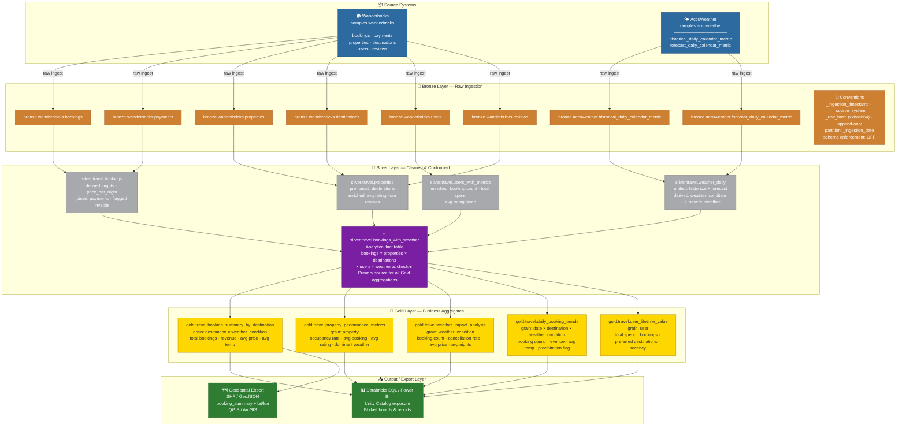

# Weather-Driven Rental Pricing Pipeline — Data Architecture

## 1. Overview

This document describes the proposed Medallion Architecture for an analytical pipeline that ingests rental property and booking data from the simulated dataset **Wanderbricks** alongside historical and forecast weather data from **AccuWeather**, with the goal of understanding how weather conditions influence rental pricing and booking behaviour across global destinations.

---

## 2. Data Sources

### 2.1 Wanderbricks (`samples.wanderbricks`)

A simulated travel and hospitality booking platform dataset comprising 7 tables (16 in total but not all are necessary for this use case) spread across three logical domains:

| Domain | Tables |
|---|---|
| Core booking facts | `bookings`, `payments` |
| Property catalogue | `properties` |
| Geography | `destinations` |
| User & behaviour | `users`, `reviews` |

Key fields relevant to this pipeline:
- `bookings.total_amount`, `bookings.check_in`, `bookings.check_out` — pricing and stay dates
- `bookings.destination_id` → `destinations.destination` — the join key to weather data
- `properties.property_type`, `properties.base_price` — property segmentation
- `reviews.rating` — quality signal

The primary join between Wanderbricks and AccuWeather is:

```sql
LOWER(destinations.destination) = LOWER(accuweather.city_name)
AND DATE(bookings.check_in)     = DATE(accuweather.date)
```
(we assume staying prices do not increase on a single booking period)

### 2.2 AccuWeather (`samples.accuweather`)

Historical and forecast daily weather data covering **50 global cities**, available in both imperial and metric units:

| Table | Description |
|---|---|
| `historical_daily_calendar_metric` | Past daily observations (°C / km/h / km) |
| `forecast_daily_calendar_metric` | Predicted conditions (same schema as historical) |

Key weather attributes: `temperature`, `humidity_relative`, `precipitation_lwe`, `has_precipitation`, `precipitation_type_desc`, `wind_speed`, `visibility`.

---

## 3. Proposed Architecture — Medallion

The pipeline follows the **Bronze → Silver → Gold** Medallion pattern, implemented on Databricks with Delta Lake tables and PySpark transformations.

### 3.1 Bronze Layer — Raw Ingestion

**Purpose:** Preserve a faithful, unmodified copy of every source record. No business logic is applied here. Mentions of some entities being abstracted implies those are served as keys to be joined with other ingested tables.

Tables created:
- `bronze.wanderbricks.bookings` — Contains data about Wanderbricks property bookings. Users and properties are abstracted.
- `bronze.wanderbricks.destinations` — Contains data about world destinations (cities).
- `bronze.wanderbricks.payments` — Represents payments for bookings. Bookings are abstracted.
- `bronze.wanderbricks.properties` — Contains data about Wanderbricks properties. Destinations are abstracted.
- `bronze.wanderbricks.users` — Contains data about Wanderbricks individual and business users.
- `bronze.wanderbricks.reviews` — Represents user reviews for properties.
- `bronze.accuweather.historical_daily_calendar_metric` — raw historical weather
- `bronze.accuweather.forecast_daily_calendar_metric` — raw forecast weather

Conventions:
- Append-only writes; existing records are never updated
- Audit columns appended: `_ingestion_timestamp`, `_source_system`, `_row_hash` (pyspark.sql.functions.xxhash64 - used to easily track duplicate rows upon ingestion)
- Partition by `_ingestion_date`, cluster (ZOrder) where necessary (to be analyzed)
- Schema enforcement **off** — schema evolution is captured, not rejected. However, schema changes trigger an alert, checkpointing when the change occurred.

### 3.2 Silver Layer — Cleaned & Conformed

**Purpose:** Apply business rules, validate data quality, resolve nulls, derive computed columns, and produce the primary analytical fact table by joining bookings to weather.

Key tables:

| Table | Description |
|---|---|
| `silver.travel.bookings` | Validated bookings; derived `nights`, `price_per_night`; joined with payments; flagged invalid records with specified invalid columns (for ex. [check_out, status, updated_at], applies to all following tables as well) |
| `silver.travel.properties` | Properties pre-joined with destinations, enriched with ratings based on reviews. |
| `silver.travel.weather_daily` | Standardised pre-joined forecasted and historical weather with derived `weather_condition` label (Rainy / Hot / Cold / Pleasant) and `is_severe_weather` flag |
| `silver.travel.users_with_metrics` | User profiles enriched with booking count, total spend, average rating given |
| **`silver.travel.bookings_with_weather`** | **Analytical fact table — bookings joined to properties and weather at check-in time; primary table for all downstream Gold aggregations** |

`bookings_with_weather` is the centrepiece of the Silver layer. It denormalises bookings, properties, destinations, users, and weather into a single wide table optimised for analytical queries.

### 3.3 Gold Layer — Business Aggregates

**Purpose:** Pre-aggregated, business-facing tables aligned to specific analytical questions. These feed dashboards, reports, and potential ML feature stores.

| Table | Grain | Key Metrics |
|---|---|---|
| `gold.travel.booking_summary_by_destination` | destination × weather_condition | total bookings, total revenue, avg price per night, avg temperature |
| `gold.travel.property_performance_metrics` | property | occupancy rate (% of days booked between first and last booking), avg booking amount, avg rating, dominant weather condition |
| `gold.travel.weather_impact_analysis` | weather_condition | booking count, cancellation rate (from payments), avg price, avg nights |
| `gold.travel.daily_booking_trends` | date × destination × weather_condition | booking count, revenue, avg temperature, precipitation flag |
| `gold.travel.user_lifetime_value` | user | total spend, total bookings, preferred destinations, days since last booking |

### 3.4 Output / Export Layer

**Purpose:** Surface data for external consumers — BI tools, downstream systems, and geospatial exports.

Planned outputs:
- **Databricks SQL / Power BI** — Gold tables exposed via Unity Catalog for dashboard consumption
- **Geospatial export (SHP / GeoJSON)** — `gold.travel.booking_summary_by_destination` augmented with lat/lon from `destinations` and exported to Shapefile or GeoJSON format for use in QGIS or ArcGIS; destination coordinates can be sourced from the `destinations` table or resolved via a geocoding step in the Silver layer

---

## 4. Architecture Diagram


